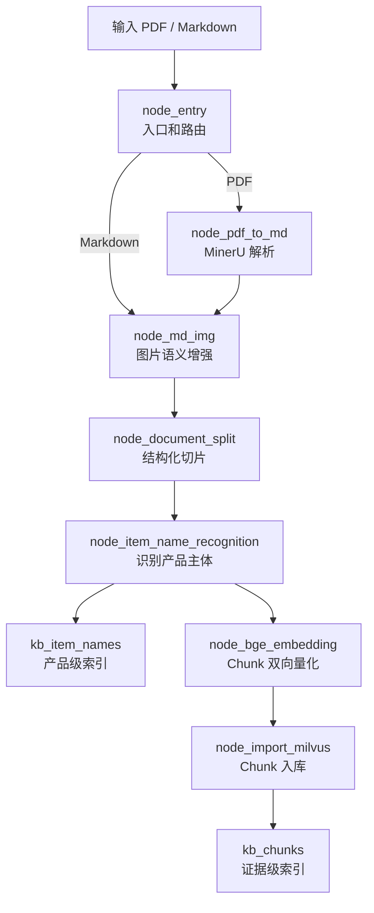
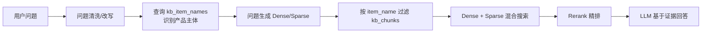

# 掌柜智库 RAG 流程教学回顾

> 文档目的：面向培训班项目复盘当前代码，理解每个节点做什么、为什么需要它，以及七个节点如何在 LangGraph 主图中联动。
>
> 当前结论：项目已经基本完成“导入建库”链路，尚未完成“用户提问后的检索、重排和回答生成”链路。

---

## 1. 先把 RAG 拆成两部分

RAG 是 Retrieval-Augmented Generation，即“检索增强生成”。它不是一次大模型调用，而是一条数据流水线。

```text
第一部分：建库
原始 PDF/Markdown
-> 解析和图片增强
-> 文档切片
-> 识别产品主体
-> 生成向量
-> 写入向量数据库

第二部分：问答
用户问题
-> 识别用户在问哪个产品
-> 检索相关 Chunk
-> 融合和重排结果
-> LLM 基于证据回答
```

当前仓库主要完成了第一部分。七个导入节点将手册加工为两个 Milvus 集合：

| 集合 | 保存什么 | 将来解决什么问题 |
| --- | --- | --- |
| `kb_item_names` | 产品/文档主体和主体向量 | “用户可能在问哪个产品？” |
| `kb_chunks` | 章节正文、元数据和双向量 | “这个产品的哪段内容能回答问题？” |

因此，当前代码已经可以“建库”；但数据库里有数据，不等于已经存在“问题 -> 回答”的完整接口。

---

## 2. 当前七节点主图



PDF 和 Markdown 的区别只在前半段：

```text
PDF      -> 入口 -> PDF 解析 -> 图片增强 -> 后续五节点
Markdown -> 入口 ------------> 图片增强 -> 后续五节点
```

图片增强之后，所有数据都已经是 Markdown 文本，所以后续节点不需要知道原始输入格式。

---

## 3. 节点联动的核心：共享状态 `ImportGraphState`

文件：`processor/import_process/core/state.py`

所有节点都接收并返回同一个状态字典。可以把它理解为一份随流水线传递的任务档案：上游把结果写进去，下游从里面读取自己需要的字段。

| 字段 | 含义 | 主要写入者 | 主要读取者 |
| --- | --- | --- | --- |
| `task_id` | 任务编号 | 调用方 | 日志和后续进度系统 |
| `local_file_path` | 原始 PDF/Markdown 路径 | 调用方 | `node_entry` |
| `local_dir` | 解析结果输出目录 | 调用方 | 入口、PDF 节点 |
| `is_pdf_read_enabled` | 是否走 PDF 分支 | 入口节点 | 主图路由 |
| `is_md_read_enabled` | 是否走 Markdown 分支 | 入口节点 | 主图路由 |
| `pdf_path` | 当前 PDF 路径 | 入口节点 | PDF 节点 |
| `md_path` | 当前 Markdown 路径 | PDF/图片节点 | 图片、切片节点 |
| `md_content` | 当前 Markdown 全文 | PDF/图片节点 | 图片、切片节点 |
| `file_title` | 来源文件名，不含扩展名 | 入口节点 | 切片、主体识别 |
| `chunks` | Chunk 字典列表 | 切片/向量节点 | 主体识别、入库 |
| `item_name` | 识别出的产品主体 | 主体识别节点 | 向量化、入库、过滤 |

状态会逐步增长：

```text
S0：local_file_path、local_dir
S1：路由标志、pdf_path 或 md_path、file_title
S2：md_path、md_content
S3：图片增强后的 md_path、md_content
S4：chunks
S5：item_name，且所有 Chunk 都有 item_name
S6：所有 Chunk 都有 dense_vector、sparse_vector
S7：所有 Chunk 都有 Milvus 回填的 chunk_id
```

最重要的联动原则是：

> 上一个节点写出的字段，必须满足下一个节点读取的字段契约。

例如，Chunk 向量化节点读取 `chunks[*].item_name` 和 `chunks[*].content`；如果主体识别节点没有回填 `item_name`，向量化的输入就不完整。

### 3.1 文件、内存和数据库不是同一件事

```text
文件系统：PDF、Markdown、图片、chunk.json
内存状态：md_content、chunks、item_name、dense/sparse、chunk_id
Milvus：kb_item_names、kb_chunks
```

`chunk.json` 是切片节点的本地备份，不一定含有后续生成的 `item_name` 和向量。正式联动应使用运行时 `state["chunks"]`，而不是假设旧 JSON 已经包含完整数据。`chunks_with_embeddings_debug.json` 也只是调试产物。

---

## 4. 主图如何控制节点顺序

文件：`processor/import_process/nodes/main_graph.py`

主图不负责具体解析、切片或向量算法。它只负责：

1. 注册节点实例；
2. 根据入口标志选择 PDF 或 Markdown 分支；
3. 通过边定义后续执行顺序。

核心顺序边是：

```text
node_pdf_to_md
-> node_md_img
-> node_document_split
-> node_item_name_recognition
-> node_bge_embedding
-> node_import_milvus
-> END
```

入口条件路由的逻辑是：

```python
if state.get("is_pdf_read_enabled"):
    return "node_pdf_to_md"
elif state.get("is_md_read_enabled"):
    return "node_md_img"
return END
```

这里体现了职责分离：入口节点只写入“该走哪个分支”的标志，主图只负责根据标志跳转。

### 4.1 `invoke()` 和 `stream()`

```python
final_state = app.invoke(initial_state)
```

`invoke()` 会等待所有节点完成后返回最终状态，适合真实导入任务。

```python
for update in app.stream(initial_state):
    print(update)
```

`stream()` 会逐节点返回更新，适合教学调试和后续 Web 进度展示。不要直接打印完整状态，因为其中会包含 1024 维向量和大量正文；更适合打印 Chunk 数量、标题、向量维度和 `chunk_id`。

---

## 5. 节点一：`node_entry`

文件：`processor/import_process/nodes/node_entry.py`

### 它做什么

它把外部传来的路径转换成工作流能够理解的文件类型、路径和标题。

```text
读取 local_file_path 和 local_dir
-> 校验两个字段非空
-> 校验原始文件存在
-> 判断扩展名
-> PDF：写入 is_pdf_read_enabled、pdf_path
-> MD：写入 is_md_read_enabled、md_path
-> 从文件名提取 file_title
```

例子：

```text
输入文件：H3C LA2608室内无线网关 用户手册-6W100-整本手册.pdf
file_title：H3C LA2608室内无线网关 用户手册-6W100-整本手册
```

这里的 `file_title` 是来源文件标识，不等于后面 LLM 识别的 `item_name`。例如：

```text
file_title = H3C LA2608室内无线网关 用户手册-6W100-整本手册
item_name  = H3CLA2608室内无线网关
```

---

## 6. 节点二：`node_pdf_to_md`

文件：`processor/import_process/nodes/node_pdf_to_md.py`

### 它做什么

PDF 更接近页面排版，文本顺序、标题层级、图片和表格关系不一定适合直接检索。该节点调用 MinerU，把 PDF 转成后续节点可以继续处理的 Markdown 和图片资源。

```text
校验 pdf_path 和 local_dir
-> 向 MinerU 请求签名上传 URL
-> PUT 上传 PDF
-> 每 3 秒轮询解析状态，最长 600 秒
-> 下载结果 ZIP 并校验完整性
-> 清理同名旧输出目录、解压
-> full.md 重命名为 <PDF主名>.md
-> 读取 Markdown，写入 md_path 和 md_content
```

输出大致为：

```python
{
    "md_path": "output/<PDF主名>/<PDF主名>.md",
    "md_content": "# 第一章\n...",
}
```

MinerU 解析目录内的 `images/` 很重要，下一节点会从这里读取手册图片。

---

## 7. 节点三：`node_md_img`

文件：`processor/import_process/nodes/node_md_img.py`

### 它做什么

产品手册中的接线图、配置图和安全警示图常常包含正文没有重复说明的知识。文本向量模型看不懂本地图片文件，因此这个节点先用视觉模型把图片转换成摘要文本，再上传图片到 MinIO。

```text
读取 md_path 和 md_content
-> 找到同级 images/ 目录
-> 扫描支持格式的图片
-> 只保留 Markdown 中真实引用的图片
-> 截取图片首次引用前后各 100 个字符
-> 图片转 Base64，调用 VLM 生成摘要
-> 清理 MinIO 当前文档的旧图片目录
-> 上传图片，获得 URL
-> 用“摘要 + MinIO URL”替换本地图片标签
-> 保存 *_new.md
```

处理前后：

```markdown
处理前：

处理后：
```

图片摘要写进 Markdown 图片标签的替代文本，因此后续切片会把它作为可检索文本的一部分。

它最终更新 `state["md_path"]` 和 `state["md_content"]`，切片节点只使用更新后的 Markdown，不需要知道图片处理的内部细节。

---

## 8. 节点四：`node_document_split`

文件：`processor/import_process/nodes/node_document_split.py`

### 它做什么

整篇手册不能作为一个向量。这个节点把 Markdown 拆成长度可控、尽量保持章节语义的 Chunk。

### 三层切片策略

#### 第一层：按标题初切

标题规则：

```regex
^\s*#{1,6}\s+.+
```

代码会跳过围栏代码块中的伪标题。初始 Section 保留标题、正文和来源文件：

```python
{
    "title": "## 网络配置",
    "content": "## 网络配置\n...",
    "file_title": "H3C LA2608...",
}
```

#### 第二层：超长章节二次切分

当前最大长度：

```text
DEFAULT_MAX_CONTENT_LENGTH = 2000
```

超长内容使用 `RecursiveCharacterTextSplitter`，优先按空行、换行、中文句子边界、英文句子边界和空格切分。二次切分后的 Chunk 会拥有：

```python
{
    "parent_title": "## 网络配置",
    "part": 1,
}
```

#### 第三层：短块合并

当前阈值：

```text
MIN_CONTENT_LENGTH = 500
```

当前块较短、下一个块属于同一个 `parent_title` 且合并后不超过 2000 字符时，才会合并。这样不会随意跨章节拼接。

### 输出

节点将最终列表写入：

```python
state["chunks"]
```

同时将它备份到：

```text
<Markdown目录>/chunks/chunk.json
```

下一节点应直接使用内存中的 `state["chunks"]`，而不是重新加载旧的 `chunk.json`。

---

## 9. 节点五：`node_item_name_recognition`

文件：`processor/import_process/nodes/node_item_name_recognition.py`

### 它做什么

该节点判断“整份文档主要在讲什么产品”，结果叫 `item_name`。它给所有 Chunk 打上相同的业务标签，并建立产品级向量索引。

```text
读取 file_title 和 chunks
-> 取前 5 个 Chunk 构造 LLM 上下文
-> 单个 Chunk 最多 800 字符，总上下文最多 2500 字符
-> 用 Prompt 调用文本 LLM
-> 清洗空格、换行和制表符
-> LLM 失败或返回空时用 file_title 兜底
-> 将 item_name 写入 state 和全部 Chunk
-> 为 item_name 生成 dense/sparse
-> 写入 kb_item_names
```

回填后的状态：

```python
state["item_name"] = "H3CLA2608室内无线网关"

for chunk in state["chunks"]:
    chunk["item_name"] = "H3CLA2608室内无线网关"
```

这里生成的是“产品主体级向量”，只编码 `item_name`，将来用于判断用户问题更接近哪个产品。

---

## 10. 节点六：`node_bge_embedding`

文件：`processor/import_process/nodes/node_bge_embedding.py`

### 它做什么

主体识别知道“这份手册是什么产品”，但还不知道“哪段正文和问题相关”。该节点为每个 Chunk 生成双向量。

每个 Chunk 的编码文本是：

```text
商品：{item_name}:介绍：{content}
```

将商品名放在正文前面，可以给技术文档中省略的主语补充上下文。

### 批处理和输出

当前批大小为 5：

```text
10 个 Chunk -> 第 1-5 条一批 -> 第 6-10 条一批
```

工具层 `embedding_utils.generate_embedding()` 会获取 BGE-M3 单例、调用 `encode_documents()`，并将输出整理成：

```python
{
    "dense": [[...1024 个 float...], ...],
    "sparse": [{12: 0.63, 48: 0.21}, ...],
}
```

节点再按输入顺序把结果回填到每个 Chunk：

```python
{
    "dense_vector": [1024 个 float],
    "sparse_vector": {特征维度: 权重},
}
```

Dense 擅长语义相似，Sparse 擅长型号、缩写和关键词精确命中。某批向量化失败时，当前代码会保留原 Chunk 并继续处理其他批；但最后入库节点要求 `dense_vector`，因此仍必须检查全部 Chunk 是否成功向量化。

---

## 11. 节点七：`node_import_milvus`

文件：`processor/import_process/nodes/node_import_milvus.py`

### 它做什么

向量放在内存状态中，进程结束后会消失。最后一个节点把带双向量的 Chunk 写入 Milvus `kb_chunks`，让后续检索能够长期使用。

```text
校验 chunks 非空且有 dense_vector
-> 获取 Milvus 客户端
-> 集合不存在时创建 Schema 和索引
-> 按 item_name 删除旧数据并 flush
-> 移除可能存在的旧 chunk_id
-> 缺少 part 时补默认值 0
-> 批量 insert
-> 读取 ids 或 inserted_ids
-> 按输入顺序回填 chunk_id
-> 将更新后的 chunks 写回 state
```

`kb_chunks` 的核心字段：

| 字段 | 用途 |
| --- | --- |
| `chunk_id` | Milvus 自动生成的主键 |
| `content` | 将来回答使用的正文证据 |
| `title`、`parent_title`、`part` | 章节定位和展示 |
| `file_title` | 来源手册追溯 |
| `item_name` | 产品过滤和幂等键 |
| `dense_vector` | HNSW + COSINE 语义检索 |
| `sparse_vector` | SPARSE_INVERTED_INDEX + IP 关键词检索 |

### 幂等写入是什么意思

当前策略：

```text
相同 item_name
-> 删除旧 Chunk
-> 插入本次最新 Chunk
```

这样重复导入不会无限增加重复数据。但它不是事务：删除成功后插入失败，旧数据已经被删除；并且当前幂等键是 `item_name`，不是 `(item_name, file_title)`，不同手册若识别成同一产品可能互相替换。

### 为什么要回填 `chunk_id`

Milvus 使用 `auto_id=True`。插入响应会返回 `ids`，节点按输入顺序把它们写回 `state["chunks"]`。以后只有 `chunk_id` 时，系统仍可以从数据库补查正文、标题和来源。

---

## 12. 七个节点的字段接力表

这一张表最适合用来排查“为什么图没有联动起来”。先看当前节点的输出，再看下一个节点是否真的需要这些字段。

| 当前节点 | 它写出的关键结果 | 下一个节点怎样使用 |
| --- | --- | --- |
| `node_entry` | 路由标志、`pdf_path`/`md_path`、`file_title` | 主图选择 PDF 或 MD 分支；PDF 节点读 `pdf_path` |
| `node_pdf_to_md` | `md_path`、`md_content` | 图片节点读取 Markdown 和同级图片目录 |
| `node_md_img` | 更新后的 `md_path`、`md_content` | 切片节点切分最终的增强 Markdown |
| `node_document_split` | `chunks[*].title/content/file_title/parent_title/part` | 主体识别节点从前几个 Chunk 识别产品 |
| `node_item_name_recognition` | `item_name`、`chunks[*].item_name` | Chunk 向量节点拼接产品名和正文；入库节点用它做过滤/幂等 |
| `node_bge_embedding` | `chunks[*].dense_vector/sparse_vector` | 入库节点写入 Milvus 向量字段 |
| `node_import_milvus` | Milvus 中的记录、`chunks[*].chunk_id` | 后续检索可按产品过滤，也可按主键补查证据 |

可以把字段接力压缩成一条线：

```text
原始路径
-> Markdown
-> Chunks
-> item_name
-> Chunk 双向量
-> chunk_id
```

任何一个字段缺失，错误通常会在下游出现：

| 缺失内容 | 常见报错位置 | 原因 |
| --- | --- | --- |
| `local_dir` | PDF 节点 | 无法确定解析产物目录 |
| `md_content` | 切片节点 | 没有可切分的文本 |
| `chunks` | 主体识别节点 | 没有 LLM 可阅读的文档上下文 |
| `item_name` | Chunk 向量节点 | 无法补足业务主语 |
| `dense_vector` | Milvus 入库节点 | 无法写入向量字段 |
| `part` | Milvus 插入 | Schema 字段不可为空，当前节点会补 `0` |

---

## 13. 用真实 H3C 手册回放一次联调

真实联调文件：

```text
doc/H3C LA2608室内无线网关 用户手册-6W100-整本手册.pdf
```

执行命令：

```powershell
.\.venv\Scripts\python.exe -m processor.import_process.nodes.main_graph
```

真实联调经历了完整外部服务调用：

```text
MinerU PDF 解析
-> VLM 生成图片摘要
-> MinIO 上传图片
-> LLM 识别产品主体
-> 本地 BGE-M3 生成双向量
-> Milvus 写入和查询
```

本次运行的关键结果：

| 阶段 | 真实结果 |
| --- | --- |
| 输入分支 | PDF 分支 |
| 图片增强 | 4 张被 Markdown 引用的图片完成 VLM 摘要和 MinIO 上传 |
| 文档切片 | 10 个 Chunk |
| 主体识别 | `H3CLA2608室内无线网关` |
| 主体级数据 | 写入 `kb_item_names` |
| Chunk 向量化 | 10 个 Chunk 均生成 Dense 和 Sparse |
| Chunk 入库 | 写入 `kb_chunks` 并回填 10 个 `chunk_id` |
| 最终验证 | Milvus 按 `item_name` 查询到 10 条，等于状态中的 Chunk 数量 |

所以“主图联动成功”不能只看最后没有报错，而应同时确认：

```text
Markdown 文件存在
AND chunks 非空
AND 所有 Chunk 有 dense_vector
AND 所有 Chunk 有 sparse_vector
AND 所有 Chunk 有合法 chunk_id
AND Milvus 实际查询数量 == state.chunks 数量
```

当前 `main_graph.py` 的 `if __name__ == "__main__"` 已经执行这类检查，因此它不仅是演示代码，也是一条真实集成测试入口。

---

## 14. 为什么主体向量和 Chunk 向量不是重复工作

很多人在第一次看到项目时都会产生这个问题：主体识别节点已经为 `item_name` 向量化了，为什么 Chunk 节点还要再次向量化？

答案是两次编码的对象和用途不同：

| 向量层级 | 编码文本 | 存储位置 | 将来解决的问题 |
| --- | --- | --- | --- |
| 主体级 | `item_name` | `kb_item_names` | 用户在问哪个产品？ |
| Chunk 级 | `商品：item_name:介绍：content` | `kb_chunks` | 哪一段内容是回答证据？ |

可以把它类比为图书馆：

```text
主体级检索：先找哪一本书
Chunk 级检索：再找这本书的哪一页
```

如果跳过主体级，多个产品资料混在一起时，查询可能召回错误产品的章节；如果跳过 Chunk 级，只知道产品名，仍无法找到具体配置步骤或安全说明。

---

## 15. 当前还没有完成的检索问答链路

仓库已经存在一些 Milvus 查询工具：

- 按 `chunk_id` 批量补查 Chunk；
- 构造 Dense 和 Sparse 两路搜索请求；
- 使用 `WeightedRanker` 做双向量加权融合。

但是当前没有完整的查询节点和问答主图。目标链路应是：



未来查询端的状态接力可以设计为：

```text
question
-> resolved_item_name
-> query_dense/query_sparse
-> retrieved_chunks
-> reranked_chunks
-> answer
```

这也说明当前项目的真实状态：

```text
导入建库：基本闭环
检索问答：基础工具已有，业务编排尚未闭环
```

---

## 16. 常见疑问回顾

### 16.1 为什么 `file_title` 和 `item_name` 都要保留

```text
file_title：来源文件和追溯标识
item_name ：业务产品和检索过滤标识
```

一个文件可能有版本号、营销标题和说明性文字；LLM 识别出的产品名更适合让不同 Chunk 建立业务关联。

### 16.2 为什么图片必须转成文本

Embedding 模型无法直接理解 `images/device.jpg` 这个路径。VLM 摘要把图片知识变成文本，图片中的安全、拓扑和配置语义才会进入后续的切片和向量。

### 16.3 为什么 `chunk.json` 不能直接作为最终入库数据

它是切片阶段的快照；主体识别和向量化发生在后面。直接读旧 JSON，往往会缺少 `item_name`、向量，或者把 JSON 中的 Sparse 字典键读成字符串。标准流程应使用 `state["chunks"]`。

### 16.4 为什么要批量处理，每批是 5 条

批量可以减少模型调用和 Python 循环开销；过大的批又可能占满 GPU 显存。当前每批 5 条是教学项目在速度和显存之间的固定折中。

### 16.5 `append` 和 `extend` 在这里为什么重要

向量化节点的 `output_data` 应该始终是“Chunk 的一维列表”。

```python
output_data.extend(batch_texts)
```

表示把这一批中的每个 Chunk 放入总列表；若用 `append(batch_texts)`，会得到“列表里面套批次列表”的嵌套结构，后续入库无法按预期遍历。

### 16.6 为什么入库前要补 `part=0`

`part` 是二次切分序号。未触发二次切分的普通 Chunk 没有这个字段，但当前 Milvus Schema 将其设为不可为空。因此入库节点用 `0` 表示“这是原章节或未二次拆分的 Chunk”。

---

## 17. 推荐的调试顺序

先验证单个节点，再验证子链路，最后验证主图。这样发生问题时能快速知道是“节点内部错”还是“字段联动错”。

### 17.1 PDF 节点单元测试

```powershell
.\.venv\Scripts\python.exe -m pytest tests/nodes/test_node_pdf_to_md.py -q
```

### 17.2 真实 BGE-M3 测试

```powershell
.\.venv\Scripts\python.exe -m pytest tests/nodes/test_node_bge_embedding_integration.py -q
```

### 17.3 真实 Milvus 入库测试

```powershell
.\.venv\Scripts\python.exe -m pytest tests/nodes/test_node_import_milvus_integration.py -q
```

### 17.4 七节点真实主图联调

```powershell
.\.venv\Scripts\python.exe -m processor.import_process.nodes.main_graph
```

调试输出建议只保留摘要：

```python
print({
    "md_path": state.get("md_path"),
    "item_name": state.get("item_name"),
    "chunk_count": len(state.get("chunks", [])),
    "dense_dim": len(state["chunks"][0].get("dense_vector", [])),
    "chunk_ids": [chunk.get("chunk_id") for chunk in state.get("chunks", [])],
})
```

不要打印完整状态，否则终端会被正文和大量 1024 维向量淹没。

---

## 18. 最终复述模板

如果要用自己的话说明项目，可以按下面顺序复述：

```text
1. 入口节点识别文件类型并准备统一状态。
2. PDF 先由 MinerU 恢复为 Markdown 和图片资源。
3. 图片节点用 VLM 把图片知识转成文本，并上传可访问图片。
4. 切片节点先按标题保持结构，再按长度控制 Chunk 大小。
5. 主体识别节点用 LLM 找到文档的产品主体，并给所有 Chunk 加标签。
6. 产品名称单独生成向量，写入 kb_item_names，用于产品对齐。
7. 每个 Chunk 将产品名和正文一起编码，生成 Dense/Sparse 双向量。
8. 入库节点把 Chunk 写入 kb_chunks，并回填数据库主键。
9. 将来查询端再通过产品级集合定位产品，通过 Chunk 集合找到证据，最后交给 LLM 回答。
```

最重要的三点是：

1. **RAG 是数据流水线，不是单一模型调用。**
2. **节点靠状态字段契约联动，主图靠边控制顺序和分支。**
3. **当前项目已基本完成建库，下一阶段重点是查询、混合召回、重排和答案生成。**
