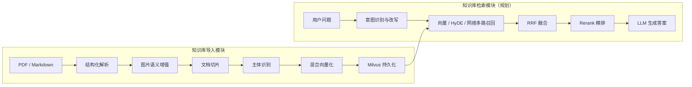
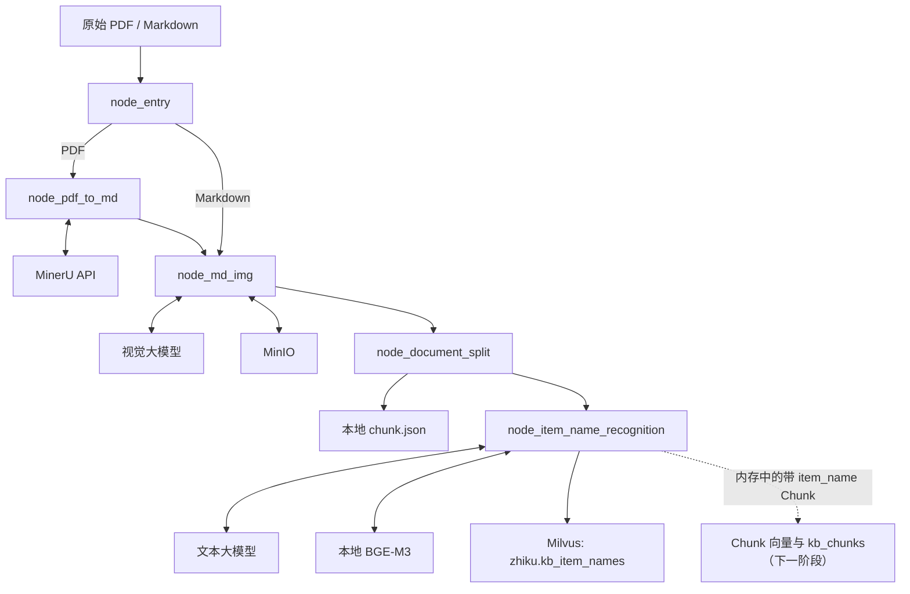
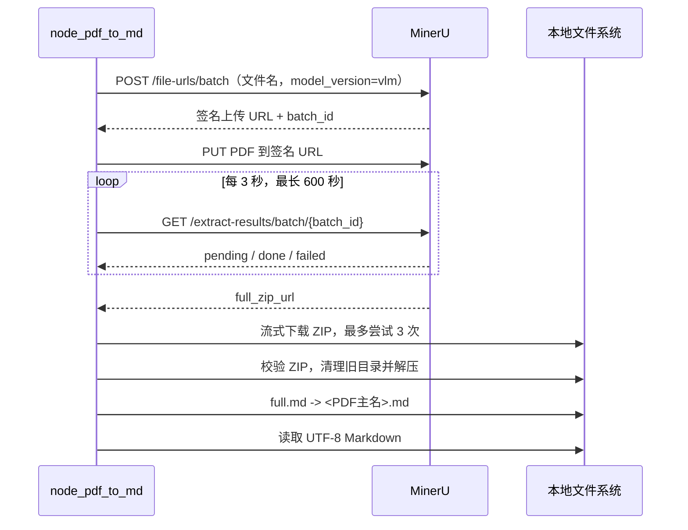
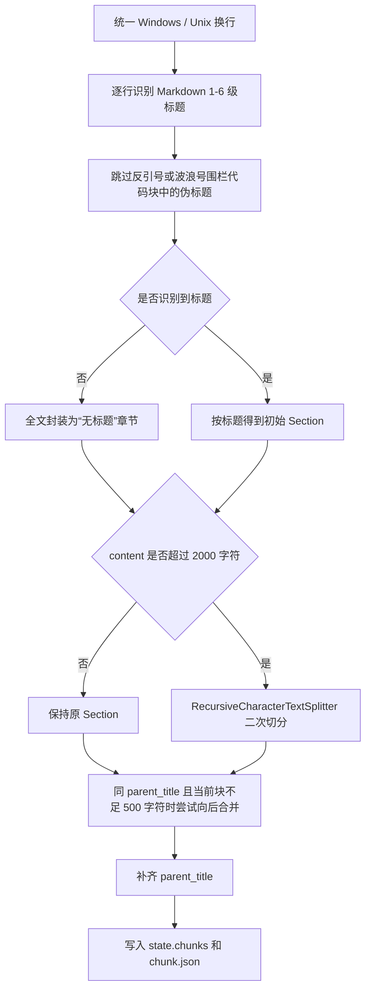
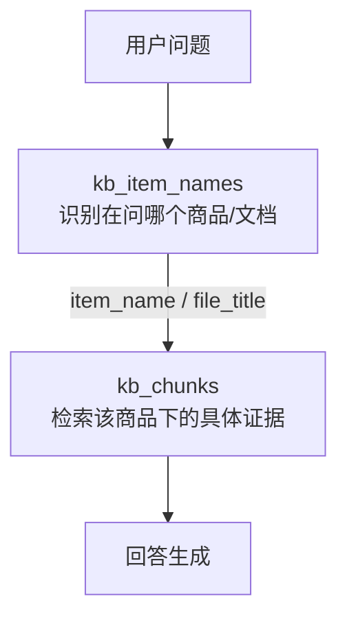

# 掌柜智库阶段性项目设计文档

> 文档版本：v1.0
> 更新时间：2026-07-28
> 当前设计边界：知识库导入流程，截止 `node_item_name_recognition`
> 事实依据：当前工作区代码、自动化测试、`output/` 真实产物、Milvus 当前状态，以及两份项目教案
> 取舍原则：代码和真实数据优先；教案用于解释总体目标与后续方向

---

## 1. 阶段结论

掌柜智库是一个面向企业产品资料的 RAG 知识库项目。它计划把产品手册等私有文档加工成可检索知识，再通过实体识别、混合检索、重排序和大模型生成完成问答。

截至本文版本，项目已经完成以下主要能力的节点级实现：

1. 接收 PDF 或 Markdown，准备不同的处理分支；
2. 使用 MinerU 将 PDF 解析成 Markdown 和图片资源；
3. 使用视觉大模型理解图片，并把本地图片引用替换为 MinIO 远程引用；
4. 按 Markdown 标题切分文档，对超长章节二次切分，对同章节短块进行合并；
5. 从文档前部识别商品主体 `item_name`，将它写入内存中的全部 Chunk；
6. 为 `item_name` 生成 BGE-M3 稠密、稀疏向量；
7. 自动创建并维护 Milvus 文档级集合 `zhiku.kb_item_names`。

当前阶段最准确的描述是：

> 文档预处理、切片、主体识别和文档级实体索引已经分别跑通；完整七节点拓扑已经写出，但统一工作流入口、Chunk 向量化和 `kb_chunks` 持久化尚未闭合。

因此，“前五个节点已有主要业务实现”不等于“整个知识库导入模块已经完成”。目前系统形成的是文档级实体索引，最终承担回答证据召回的切片级知识库仍属于下一阶段。

### 1.1 当前能力边界

| 层级 | 当前状态 | 说明 |
| --- | --- | --- |
| 文档接入 | 已有主要实现 | 支持 `.pdf` 和 `.md` 分支 |
| PDF 结构化 | 已有主要实现 | MinerU 上传、轮询、下载、解压 |
| 图片语义增强 | 已有主要实现 | VLM 摘要、MinIO 上传、Markdown 替换 |
| Markdown 切片 | 已有主要实现 | 标题切分、长块拆分、同章节短块合并 |
| 商品主体识别 | 已有主要实现 | LLM 识别、清洗、兜底、Chunk 回填 |
| 文档级商品向量 | 已有主要实现 | BGE-M3 dense + sparse |
| `kb_item_names` | 已创建并有真实数据 | 当前位于 Milvus `zhiku` 数据库 |
| 统一端到端工作流 | 尚需收口 | 入口导入、状态字段和节点契约仍有不一致 |
| Chunk 混合向量 | 未实现 | `node_bge_embedding` 仍为 TODO 骨架 |
| `kb_chunks` 持久化 | 未实现 | `node_import_milvus` 仍为 TODO 骨架 |
| 检索与问答链路 | 未实现 | 当前只存在教案中的目标设计 |

### 1.2 本文如何区分事实

本文使用三种表述，避免把目标架构和当前实现混在一起：

- **当前实现**：能从当前代码中直接确认的行为；
- **已验证现状**：能从测试、磁盘产物或真实 Milvus 查询中确认的结果；
- **规划设计**：来自教案或下一节点的目标，尚不能视为现有能力。

---

## 2. 项目目标与总体架构

### 2.1 项目要解决的问题

通用大模型并不知道企业内部产品手册的全部细节。即使模型见过相似产品，也可能在型号、参数、安全要求和操作步骤上产生幻觉。掌柜智库采用 RAG 的核心思路：先从私有知识库中检索证据，再让大模型依据证据回答。

这要求项目同时解决两类问题：

1. **建库问题**：怎样把 PDF、Markdown、图片和表格转成可独立检索的知识单元；
2. **查询问题**：怎样理解用户在问哪个产品，召回相关证据，过滤噪声并生成答案。

当前开发集中在第一类问题。

### 2.2 教案规划的完整系统



检索模块中的问题改写、HyDE、网络搜索、RRF、Rerank、答案生成和 SSE 输出目前都属于规划范围。本文只说明导入模块如何为这些能力准备数据。

### 2.3 当前实际形成的系统边界



这里存在两种不同的持久化结果：

- `node_document_split` 把切片备份到本地 JSON；
- `node_item_name_recognition` 把文档主体及其向量写入 Milvus。

主体识别后写入 Chunk 的 `item_name` 目前只存在于运行时状态中，节点不会重新覆盖前一步的 Chunk JSON。后续 `node_import_milvus` 应直接消费内存状态，而不能假设旧 JSON 已经包含 `item_name`。

---

## 3. 代码架构

### 3.1 分层结构

当前仓库可以划分为五个层次。

| 层次 | 目录 | 职责 |
| --- | --- | --- |
| 流程与状态层 | `processor/import_process/core` | 状态模型、节点基类、自定义异常 |
| 业务节点层 | `processor/import_process/nodes` | 七节点拓扑和各阶段业务处理 |
| 基础能力层 | `processor/utils` | LLM、Embedding、Milvus、MinIO、Prompt、限速等公共能力 |
| 配置层 | `processor/config` | MinerU、LLM、Embedding、Milvus、MinIO 配置 |
| 验证与产物层 | `tests`、`output`、`logs` | 自动化测试、真实处理结果和运行日志 |

### 3.2 目录职责

```text
zhanggui_zhiku/
├── processor/
│   ├── common/
│   │   └── logger.py
│   ├── config/
│   │   ├── config.py
│   │   ├── embedding_config.py
│   │   ├── llm_config.py
│   │   ├── milvus_config.py
│   │   └── minio_config.py
│   ├── import_process/
│   │   ├── core/
│   │   │   ├── base.py
│   │   │   ├── exceptions.py
│   │   │   └── state.py
│   │   └── nodes/
│   │       ├── kb_import_workflow.py
│   │       ├── main_graph.py
│   │       ├── node_entry.py
│   │       ├── node_pdf_to_md.py
│   │       ├── node_md_img.py
│   │       ├── node_document_split.py
│   │       ├── node_item_name_recognition.py
│   │       ├── node_bge_embedding.py
│   │       └── node_import_milvus.py
│   └── utils/
│       ├── client/
│       │   ├── milvus_client.py
│       │   └── minio_client.py
│       ├── lm/
│       │   ├── embedding_utils.py
│       │   └── llm_client.py
│       ├── prompt/load_prompt.py
│       ├── escape_milvus_string_utils.py
│       ├── path_util.py
│       └── rate_limit_utils.py
├── prompts/
│   ├── image_summary.prompt
│   ├── item_name_recognition.prompt
│   └── product_recognition_system.prompt
├── tests/nodes/
├── output/
├── logs/
├── models/
├── 项目设计文档/
├── .env.example
├── pyproject.toml
└── uv.lock
```

### 3.3 节点抽象

所有业务节点继承 `BaseNode` 并实现 `process(state)`。LangGraph 调用节点实例时，实际进入 `BaseNode.__call__()`：

```text
记录节点开始
-> 调用子类 process(state)
-> 记录节点完成
-> 未捕获异常统一包装为 ImportProcessError
```

这个抽象希望提供统一日志、错误包装和节点接口。但是当前部分业务节点在 `process()` 内部已经捕获并吞掉异常，因此异常不一定能够到达 `BaseNode`。实际错误语义将在第 9 章单独说明。

### 3.4 两个工作流入口

仓库中存在两个 LangGraph 入口：

- `kb_import_workflow.py`：类式封装，包含节点初始化、注册、条件边、编译、`invoke/stream`；这是更接近当前目标结构的版本；
- `main_graph.py`：早期函数式版本，仍保留拼写和路由条件问题，不应作为当前设计基线。

`KBImportWorkflow` 注册的目标拓扑是：

```text
node_entry
  ├─ PDF -> node_pdf_to_md -> node_md_img
  └─ MD  -----------------> node_md_img
         -> node_document_split
         -> node_item_name_recognition
         -> node_bge_embedding
         -> node_import_milvus
         -> END
```

需要注意：这是已经声明的图结构，不是已经稳定贯通的端到端能力。当前类式入口本身存在 `logger` 导入错误，PDF 输出目录字段也未统一，最后两个节点仍是 TODO。

---

## 4. 状态驱动的数据设计

### 4.1 `ImportGraphState`

节点之间通过同一个 `ImportGraphState` 字典交换数据。它是 `total=False` 的 `TypedDict`，表示类型检查层面所有字段都允许缺失；运行时仍需要各节点自行校验必需字段。

| 字段 | 含义 | 主要写入者 | 主要读取者 |
| --- | --- | --- | --- |
| `task_id` | 任务标识，预留给日志和 Web 进度 | 外部调用方 | 当前业务逻辑尚未真正使用 |
| `import_file_path` | 原始导入文件 | 外部调用方 | `node_entry` |
| `local_dir` | 约定的输出目录 | 外部调用方 | `node_entry` 只校验；PDF 节点当前未按此字段读取 |
| `is_pdf_read_enabled` | PDF 分支标志 | `node_entry` | LangGraph 路由 |
| `is_md_read_enabled` | Markdown 分支标志 | `node_entry` | LangGraph 路由 |
| `pdf_path` | PDF 文件路径 | `node_entry` | `node_pdf_to_md` |
| `md_path` | 当前 Markdown 文件路径 | 入口/PDF/图片节点 | 图片、切片备份节点 |
| `file_title` | 去掉扩展名的文档标题 | `node_entry` | 切片和主体识别 |
| `md_content` | 当前 Markdown 正文 | PDF/图片节点 | 图片和切片节点 |
| `chunks` | 切片字典列表 | `node_document_split` | 主体识别及后续节点 |
| `item_name` | 文档核心商品名称 | `node_item_name_recognition` | 后续向量化、过滤和入库 |

默认状态通过 `copy.deepcopy()` 创建，避免多个任务共享同一个默认 `chunks` 列表。

### 4.2 状态如何逐步增长

下面以 PDF 文档为例说明状态的核心变化。为便于阅读，只列出每一步关心的字段。

#### S0：外部输入

```python
{
    "task_id": "task_hak180",
    "import_file_path": ".../hak180产品安全手册.pdf",
    "local_dir": ".../output"
}
```

#### S1：入口识别后

```python
{
    "is_pdf_read_enabled": True,
    "pdf_path": ".../hak180产品安全手册.pdf",
    "file_title": "hak180产品安全手册"
}
```

#### S2：MinerU 解析后

```python
{
    "md_path": ".../hak180产品安全手册/hak180产品安全手册.md",
    "md_content": "# HAK 180 烫金机\n..."
}
```

#### S3：图片增强后

```python
{
    "md_path": ".../hak180产品安全手册/hak180产品安全手册_new.md",
    "md_content": "......"
}
```

#### S4：文档切片后

```python
{
    "chunks": [
        {
            "title": "# HAK 180 烫金机",
            "content": "...",
            "file_title": "hak180产品安全手册",
            "parent_title": "# HAK 180 烫金机",
            "part": 1
        }
    ]
}
```

#### S5：主体识别后

```python
{
    "item_name": "BrotherHAK180烫金机",
    "chunks": [
        {
            "title": "# HAK 180 烫金机",
            "content": "...",
            "file_title": "hak180产品安全手册",
            "parent_title": "# HAK 180 烫金机",
            "part": 1,
            "item_name": "BrotherHAK180烫金机"
        }
    ]
}
```

商品名称向量不会写回 `state`，而是在节点内部直接交给 Milvus。这个决策让文档级向量不占用流程状态，但也意味着后续节点不能从状态中复用这组向量。

### 4.3 当前状态模型的核心特点

1. 节点普遍就地修改并返回同一个字典；
2. 状态既承担控制流标志，也承担业务数据；
3. 本地文件、内存状态和数据库分别保存不同阶段的数据；
4. 当前没有 `status`、`warnings`、`errors`、`current_node` 等结构化执行结果字段；
5. 降级后继续执行时，上层只能通过日志判断是否完整成功。

---

## 5. 知识库导入流程设计

### 5.1 `node_entry`：文件接入与路由准备

#### 设计目的

入口节点把文件系统中的原始文件转换为工作流可以理解的状态：判断输入类型、设置分支标志，并生成贯穿后续流程的 `file_title`。

#### 当前输入输出契约

| 类型 | 字段 |
| --- | --- |
| 输入 | `import_file_path`、`local_dir` |
| PDF 输出 | `is_pdf_read_enabled=True`、`pdf_path`、`file_title` |
| Markdown 输出 | `is_md_read_enabled=True`、`md_path`、`file_title` |
| 文件副作用 | 无 |

#### 实际处理顺序

```text
检查 import_file_path 非空
-> 检查 local_dir 非空
-> 检查原始文件真实存在
-> 按扩展名设置 PDF 或 Markdown 标志
-> 用文件主名生成 file_title
```

`file_title` 是来源文档标识，不等于商品名称。例如：

```text
file_title = hak180产品安全手册
item_name  = BrotherHAK180烫金机
```

这种分离非常重要：前者回答“数据来自哪个文件”，后者回答“文档在讲哪个业务对象”。

#### 当前边界

- 注释声明 `task_id` 必填，但代码没有校验或使用；
- 后缀判断区分大小写；
- 不支持的类型只记录警告，随后由路由进入 `END`；
- 状态复用时没有主动重置两个路由标志。

---

### 5.2 `node_pdf_to_md`：从排版文档到结构化 Markdown

#### 设计目的

PDF 主要描述页面如何显示，并不天然表达章节结构。直接抽取文本容易出现阅读顺序错乱、标题丢失、表格破碎和图文分离。该节点使用 MinerU 将 PDF 转成后续节点可以继续加工的 Markdown。

#### 当前输入输出契约

| 类型 | 字段/副作用 |
| --- | --- |
| 输入 | `pdf_path`；实现中实际还读取 `file_path` 作为输出目录 |
| 输出 | `md_path`、`md_content` |
| 外部服务 | MinerU API |
| 文件副作用 | 下载 ZIP、清理同名旧解压目录、解压、重命名 `full.md` |

#### MinerU 交互时序



#### 产物设计

真实 MinerU 目录不只有 Markdown，还保留：

- 原始 PDF；
- `layout.json`；
- 内容列表和模型结果 JSON；
- `images/` 图片目录；
- 解析后的 Markdown。

保留这些中间产物有两个价值：一是图片节点需要使用 `images/`，二是解析或切片出现问题时可以追溯 MinerU 的原始结果。

#### 当前鲁棒性

- 轮询请求设置 10 秒网络超时；
- 任务轮询总时长限制为 600 秒；
- ZIP 使用流式下载，连接和读取超时分别为 20 秒、300 秒；
- ZIP 下载失败最多重试 3 次；
- 下载完成后用 `zipfile.is_zipfile()` 校验完整性；
- MinerU 返回 `failed` 时抛出带业务错误信息的异常。

#### 当前边界

- 状态定义和注释使用 `local_dir`，实现实际读取 `file_path`，完整工作流必须先统一；
- 获取签名 URL 的 POST 和上传 PDF 的 PUT 当前未设置请求超时；
- 重跑时会删除同名解压目录；
- 代码固定假设 ZIP 根目录存在 `full.md`；
- 成功后保留下载的 ZIP，没有清理策略。

---

### 5.3 `node_md_img`：把视觉信息变成可检索文本

#### 设计目的

产品手册中的警示图、结构图和操作图经常包含正文没有重复描述的知识。如果只向量化正文，图片中的信息无法进入文本检索。因此该节点做两类增强：

1. 让 VLM 根据图片及其附近文字生成中文摘要；
2. 把本地图片上传到 MinIO，避免 Markdown 离开原目录后图片失效。

#### 当前输入输出契约

| 类型 | 字段/副作用 |
| --- | --- |
| 输入 | `md_path`、`md_content` |
| 输出 | 更新后的 `md_path`、`md_content` |
| 外部服务 | OpenAI 兼容 VLM API、MinIO |
| 文件副作用 | 生成 `<原文件名>_new.md` |
| 对象存储副作用 | 清理文档前缀下旧图片，再上传当前图片 |

#### 实际处理流程

```text
取得 Markdown 路径和内容
-> 定位同级 images/ 目录
-> 遍历 jpg/jpeg/png/gif/bmp/webp
-> 只保留在 Markdown 中真实引用的图片
-> 截取首次引用前后各 100 字符
-> 图片编码为 Base64
-> VLM 按 Prompt 要求生成 50 字以内中文摘要
-> 清理 MinIO 中当前文档旧目录
-> 上传图片并生成 URL
-> 替换 Markdown 图片标签
-> 写入 *_new.md
```

#### 图片增强的真实数据形式

当前代码不是在图片后面追加独立的说明段落，而是把 VLM 摘要写入 Markdown 图片的替代文本：

```markdown
处理前：


处理后：

```

这样既保留图片引用，也把图片语义放入 Markdown 文本。后续切片会把整条图片标签作为正文的一部分。

#### 为什么给图片提供前后文

同一张外观图可能表达安装、警告或操作步骤。节点从图片首次引用位置截取上文和下文，让 VLM 知道图片在当前章节中的用途。Prompt 还会加入文档主名，减少脱离业务场景的通用描述。

#### 降级与幂等

- VLM 调用失败时使用“图片描述”作为摘要；
- 单图上传失败时，该图不会进入替换映射，原 Markdown 引用得以保留；
- 每次处理前清理相同 MinIO 文档前缀，避免旧图片残留；
- API 限速使用滑动窗口，当前硬编码为每 60 秒最多 10 次。

#### 当前边界

- 如果没有 `images/` 目录，节点直接返回；从文件读取的 `md_content` 没有写回状态；
- 如果目录存在但没有目标图片，日志说跳过，代码仍会继续清理 MinIO 前缀并生成 `_new.md`；
- 图片上下文、支持格式和限速参数当前没有使用综合 `ImportConfig`；
- MinIO 客户端在模块导入时连接服务、创建 Bucket 并设置匿名只读策略；
- MinIO 客户端初始化固定 `secure=False`，与专用配置中的安全开关没有完全统一；
- 清理旧对象和上传新对象不是事务操作，中途失败可能形成部分更新。

---

### 5.4 `node_document_split`：构造最小知识单元

#### 设计目的

整篇产品手册太长，不能作为一个向量或一次 LLM 上下文。切片的目标也不只是“变短”，而是尽量让每个 Chunk 保持清晰的章节来源和可解释性。

当前算法遵循“先利用文档结构，再处理长度”的原则。

#### 当前输入输出契约

| 类型 | 字段/副作用 |
| --- | --- |
| 输入 | `md_content`、`file_title`、`md_path` |
| 输出 | `chunks` |
| 文件副作用 | 写入 Markdown 同级目录下的 `chunks/chunk.json` |

#### 切片算法



#### 第一层：按 Markdown 标题切分

标题识别规则是：

```regex
^\s*#{1,6}\s+.+
```

它接受 1 到 6 级 Markdown 标题，并允许标题前有缩进。代码通过跟踪围栏代码块状态，避免把代码中的 `# comment` 误判为业务标题。

初切后的 Section 包含：

```python
{
    "title": 当前标题,
    "content": 从当前标题到下一标题之前的内容,
    "file_title": 来源文件标题
}
```

标题本身也会保留在 `content` 开头，使 Chunk 即使脱离元数据字段仍能看到章节主题。

#### 第二层：超长章节二次切分

当前最大字符数：

```text
DEFAULT_MAX_CONTENT_LENGTH = 2000
```

超长章节通过 `RecursiveCharacterTextSplitter` 按以下优先级寻找边界：

```text
空行 -> 换行 -> 中文句号/感叹号/问号/分号
     -> 英文句号/感叹号/问号/分号 -> 空格
```

切分前先计算标题前缀占用的长度；每个子 Chunk 重新加上原始标题，并写入：

```python
{
    "title": "<原始标题>-<序号>",
    "content": "<原始标题>\n\n<子内容>",
    "parent_title": "<原始标题>",
    "part": 序号,
    "file_title": "<来源文档>"
}
```

当前 `chunk_overlap=0`，教案中提到的 10% 到 20% overlap 尚未体现在代码里。

#### 第三层：同章节短块合并

当前短块阈值：

```text
MIN_CONTENT_LENGTH = 500
```

只有同时满足以下条件才合并：

1. 当前待输出 Chunk 小于 500 字符；
2. 下一个 Chunk 和当前 Chunk 的 `parent_title` 相同；
3. 合并后不超过 2000 字符。

这意味着合并主要发生在同一超长章节被二次切分出的相邻子块之间，不会随意跨标题拼接不同主题。

#### `parent_title` 的准确含义

当前代码没有构建完整的 Markdown 标题树。`parent_title` 表示“这个 Chunk 来源的原始章节标题”：

- 二次切分后的子 Chunk：`parent_title` 是拆分前标题；
- 未二次切分的普通 Section：通常用自身 `title` 兜底；
- 它不是严格意义上的上一级 `# / ## / ###` 父标题路径。

因此不能把当前实现描述为已经拥有完整的“文档标题层级路径”。

#### 当前 Chunk 契约

| 字段 | 当前含义 | 是否始终存在 |
| --- | --- | --- |
| `title` | 当前章节标题或子块标题 | 是 |
| `content` | 包含标题及正文的检索内容 | 是 |
| `file_title` | 来源文档主名 | 是 |
| `parent_title` | 原始章节标题或自身标题兜底 | 精细化后补齐 |
| `part` | 原章节二次切分序号 | 否 |
| `item_name` | 文档商品主体 | 此节点没有；下一节点只在内存中补充 |

#### 备份时点

`chunk.json` 在商品主体识别之前写入，因此磁盘备份不会自动带有 `item_name`。当前数据流是：

```text
切片完成 -> 写 chunk.json
        -> 主体识别 -> 修改 state.chunks
```

后续若希望 JSON 成为最终可重放数据，需要在主体识别后再次持久化，或者明确把它定位为“切片阶段调试快照”。

#### 当前边界

- 2000/500 为节点内常量，没有读取 `ImportConfig`；
- 只在 `md_content is None` 时终止，空字符串仍会进入无标题逻辑；
- 最后一个短块不会主动向前合并；
- `RecursiveCharacterTextSplitter` 的分隔符列表没有最终空字符串硬切规则，极端连续长文本不一定满足上限；
- 节点捕获所有异常后仍返回状态，LangGraph 可能把降级结果视为成功。

---

### 5.5 `node_item_name_recognition`：建立“主体—切片”关联

#### 设计目的

产品手册的局部段落经常省略主语，例如只写“请关闭设备电源”或“重量为 200g”。如果不同产品的切片一起检索，单靠局部正文很难判断它属于哪个商品。

该节点从文档头部识别统一的 `item_name`，再把它写入所有 Chunk。这样形成两种关系：

```text
文件 -> 主体：file_title -> item_name
主体 -> 切片：item_name -> chunks[*]
```

#### 当前输入输出契约

| 类型 | 字段/副作用 |
| --- | --- |
| 输入 | `file_title`、`chunks` |
| 状态输出 | `item_name`、带 `item_name` 的 `chunks` |
| 模型副作用 | 调用文本 LLM；加载/调用本地 BGE-M3 |
| 数据库副作用 | 创建或更新 `kb_item_names` |
| 文件副作用 | 无，不会重写 Chunk JSON |

#### 节点内部六步流程


##### 步骤 1：输入兜底

标题优先级：

```text
state.file_title
-> state.file_name
-> 第一个 Chunk 的 file_title
-> 空字符串
```

`chunks` 必须是列表。列表为空时，节点记录警告并直接返回原状态。

##### 步骤 2：上下文压缩

当前参数：

```text
最多查看列表前 5 个位置
每个 Chunk 正文最多 800 字符
最终上下文最多 2500 字符
```

每个有效片段被格式化为：

```text
【切片1
标题：# HAK 180 烫金机
内容# HAK 180 烫金机 ...】

【切片2
标题：# 警告
内容# 警告 ...】
```

两个换行符让不同切片之间形成空行，便于模型区分。最终字符串再次硬截断到 2500 字符，因此最后一个片段可能在中间被截断。

##### 步骤 3：LLM 主体识别

Prompt 分为两部分：

- `product_recognition_system.prompt`：要求模型充当商品识别专家，只输出名称；
- `item_name_recognition.prompt`：提供文件名和正文切片，要求优先输出品牌、型号和商品名。

代码通过标准 `SystemMessage + HumanMessage` 调用 OpenAI 兼容 API。返回结果使用：

```python
getattr(response, "content", "").strip()
```

兼容性地读取 `content`。随后删除空格、换行、回车和制表符，所以 `HAK 180` 会规范为 `HAK180`。

当前空上下文、LLM 异常或空响应都使用 `file_title` 兜底。配置中虽然存在 `ITEM_MODEL`，但这一步实际调用默认 LLM 客户端，使用 `LLM_DEFAULT_MODEL`。

##### 步骤 4：回填全部 Chunk

识别结果同时写入：

```python
state["item_name"] = item_name
chunk["item_name"] = item_name
```

所有 Chunk 共享同一个主体标签。这是后续结构化过滤的基础，但目前只在内存状态中完成。

##### 步骤 5：生成文档主体双向量

节点调用：

```python
generate_embedding([item_name])
```

即使只有一条文本也使用列表，以维持批处理契约。返回：

```python
{
    "dense": [[...]],
    "sparse": [{维度索引: 权重, ...}]
}
```

当前只取第 0 条，作为文档主体向量。

##### 步骤 6：保存文档级索引

节点从环境变量读取 Milvus 地址和商品名称集合。流程为：

```text
连接 Milvus 指定数据库
-> 集合不存在则创建 Schema 和索引
-> load_collection
-> 按 item_name 精确删除历史记录
-> 插入 file_title、item_name、dense、sparse
-> 再次 load_collection
```

这一步已经超出了教案中“节点 5 只识别主体”的原始分工。当前代码把主体识别、主体向量化和文档级集合维护放在同一个节点里，形成一个文档级索引闭环。后续节点应专注 Chunk，而不是重复保存 `item_name` 向量。

#### 当前降级语义

| 故障 | 当前结果 |
| --- | --- |
| 没有 Chunk | 跳过节点，原状态返回 |
| 上下文为空 | `file_title` 作为 `item_name` |
| LLM 失败或返回空 | `file_title` 作为 `item_name` |
| BGE-M3 失败 | 返回 `(None, None)`，继续尝试保存 |
| Milvus 配置/连接/写入失败 | 返回 `False`，保留内存中的 `item_name` |
| 未预期节点异常 | 设置 `item_name="未知商品"`，返回状态 |

这种设计优先保证流程不因单一外部依赖中断，但“识别完成”和“完整入库成功”是两个不同状态。当前状态模型没有字段直接区分它们。

---

## 6. BGE-M3 混合向量设计

### 6.1 为什么同时使用 Dense 和 Sparse

| 向量 | 擅长解决的问题 | 示例 |
| --- | --- | --- |
| Dense 稠密向量 | 语义相近、同义表达、隐含关联 | “烫金设备”匹配“烫金机” |
| Sparse 稀疏向量 | 型号、专有名词、关键词精确命中 | “HAK180”匹配同型号资料 |

产品知识库同时存在自然语言问题和大量精确型号。只使用 Dense 可能弱化型号，只有 Sparse 又无法理解同义表达。BGE-M3 一次编码同时产生两类向量，适合后续混合检索。

### 6.2 模型加载

`embedding_utils.py` 使用进程级懒加载单例：

```text
第一次 generate_embedding
-> 读取 BGE_M3_PATH / BGE_DEVICE / BGE_FP16
-> 初始化 BGEM3EmbeddingFunction
-> 缓存在 _bge_m3_ef
后续调用直接复用
```

模型初始化开启 `normalize_embeddings=True`。在当前 BGE-M3 实现中，这个开关归一化的是 Dense embedding；Sparse 输出仍是模型产生的 lexical weights，不会随该开关做 L2 归一化：

```python
normalize_embeddings=True
```

因此当前度量关系是：

```text
Dense：归一化向量，Milvus 使用 COSINE
Sparse：原始词项权重，Milvus 使用 IP
```

单例复用可以避免每条数据反复加载模型和占用 GPU 显存。

### 6.3 返回格式转换

Dense 原始结果是 NumPy 数组，逐条 `.tolist()` 转成普通 `list[float]`。

Sparse 原始结果是批量 CSR 矩阵：

```text
indptr  -> 每条文本非零数据的起止位置
indices -> 非零权重所在维度
data    -> 与 indices 一一对应的权重
```

第 `i` 条文本的转换过程：

```python
start = sparse.indptr[i]
end = sparse.indptr[i + 1]
indices = sparse.indices[start:end].tolist()
weights = sparse.data[start:end].tolist()
sparse_dict = dict(zip(indices, weights))
```

最终 `dense` 和 `sparse` 都是 Python 原生类型，便于 JSON 序列化和 Milvus 写入。

### 6.4 当前使用范围

当前 BGE-M3 只在 `node_item_name_recognition` 中对文档主体名称编码。教案规划的“`item_name + content` 形成 Chunk 向量”尚未实现，应由 `node_bge_embedding` 完成。

---

## 7. 知识库数据模型

### 7.1 为什么设计两级集合

掌柜智库不是把全部内容塞进一个集合，而是规划文档主体级和知识切片级两层索引：



- 文档级索引回答：“用户可能在问哪个主体？”
- 切片级索引回答：“关于这个主体，哪几段内容能回答问题？”

这能处理“苹果手机”和“iPhone”这样的名称语义对齐，也能减少多个产品手册混在一起时的切片歧义。

### 7.2 已实现：`zhiku.kb_item_names`

2026-07-28 对真实 Milvus 的只读查询确认：

```text
database   = zhiku
collection = kb_item_names
rows       = 1
```

当前显式 Schema：

| 字段 | Milvus 类型 | 约束/含义 |
| --- | --- | --- |
| `pk` | `INT64` | 自增主键 |
| `file_title` | `VARCHAR(65535)` | 来源文件标题 |
| `dense_vector` | `FLOAT_VECTOR(1024)` | 商品主体语义向量 |
| `sparse_vector` | `SPARSE_FLOAT_VECTOR` | 商品主体关键词向量 |

集合启用了 `enable_dynamic_field=True`，所以 `item_name` 当前作为动态字段写入，而不是显式 Schema 字段。

当前索引：

| 索引名 | 字段 | 类型 | 度量 | 参数/状态 |
| --- | --- | --- | --- | --- |
| `dense_vector_index` | `dense_vector` | HNSW | COSINE | `M=16`、`efConstruction=200`、Finished |
| `sparse_vector_index` | `sparse_vector` | SPARSE_INVERTED_INDEX | IP | `DAAT_MAXSCORE`、不量化、Finished |

真实集合当前保存一条 HAK180 文档级实体：

```text
file_title = hak180产品安全手册
item_name  = BrotherHAK180烫金机
```

### 7.3 当前幂等策略

幂等键是清洗后的 `item_name`：

```text
clean_item_name
-> 转义反斜杠、双引号和控制字符
-> delete(filter='item_name == "..."')
-> insert(最新记录)
```

它实现的是“同名商品记录替换”，不是“同一文件记录替换”。因此：

- 同一商品重复执行不会无限新增文档级实体；
- 两份不同文件如果识别为同一 `item_name`，后写入者会替换先写入者；
- 删除和插入不是原子事务，插入失败时旧记录已经被删除。

后续需要根据业务决定，一件商品是否只允许一个实体记录，还是应以 `(item_name, file_title)` 作为文档级唯一关系。

### 7.4 规划中：`kb_chunks`

教案规划的切片级集合字段为：

| 字段 | 目标用途 |
| --- | --- |
| `chunk_id` | Chunk 唯一标识和主键查询 |
| `content` | 作为回答证据的正文 |
| `title` | 当前章节或子块标题 |
| `parent_title` | 原始章节关联 |
| `part` | 二次切分顺序 |
| `file_title` | 来源文档过滤和追溯 |
| `item_name` | 商品主体过滤 |
| `dense_vector` | 语义检索 |
| `sparse_vector` | 关键词和型号检索 |

当前代码已经为这个集合准备了部分查询工具，例如按 `chunk_id` 批量补全字段、构造 Dense/Sparse 搜索请求和加权混合检索，但尚未创建 `kb_chunks` Schema，也没有把现有 Chunk 写进去。这些工具是基础能力储备，不代表检索链路已经实现。

---

## 8. 配置、客户端与 Prompt 设计

### 8.1 配置组织

项目当前同时存在：

- 综合 `ImportConfig`；
- `EmbeddingConfig`；
- `LlmConfig`；
- `MilvusConfig`；
- `MinIOConfig`；
- 个别节点直接调用 `os.getenv()`。

实际使用关系：

| 能力 | 当前配置来源 |
| --- | --- |
| MinerU | 综合 `get_config()` |
| 文本/VLM 客户端 | `llm_config` |
| BGE-M3 | `embeddings_config` |
| Milvus 客户端 | `milvus_config` |
| 商品集合名称 | 节点内直接读取环境变量 |
| MinIO | `minio_config` |
| 切片和上下文参数 | 多数为节点内常量 |

综合配置中的 `max_content_length`、`img_content_length`、`item_name_chunk_k` 和 `requests_per_minute` 等参数目前没有真正驱动对应节点。下一阶段应先确定单一配置入口，避免“配置文件已修改但运行行为没变化”。

### 8.2 客户端复用

| 客户端/模型 | 当前生命周期 |
| --- | --- |
| LLM | 按 `(模型名, json_mode)` 缓存 |
| BGE-M3 | 进程级懒加载单例 |
| Milvus | 进程级懒连接单例 |
| MinIO | 模块导入阶段创建全局客户端 |

LLM、BGE-M3 和 Milvus 的复用都减少了重复初始化成本。MinIO 的导入期初始化还会创建 Bucket 和设置匿名读取策略，属于较强的模块导入副作用，后续更适合改为显式初始化。

### 8.3 Prompt 外置

Prompt 文件与 Python 逻辑分离：

- 图片摘要 Prompt 接收文档名、图片上文、图片下文；
- 商品识别 Prompt 接收 `file_title` 和压缩后的 Chunk 上下文；
- 系统 Prompt 约束商品识别只返回一个字符串。

`load_prompt()` 使用 Python `str.format()` 注入变量。这样可在不修改节点控制流的情况下调整模型指令，也便于单元测试替换 Prompt 加载结果。

---

## 9. 错误处理与可观测性

### 9.1 当前三种错误策略

| 策略 | 代表节点/步骤 | 行为 |
| --- | --- | --- |
| 失败即中止 | `node_entry`、`node_pdf_to_md`、图片核心文件错误 | 异常向上到 `BaseNode`，包装为 `ImportProcessError` |
| 记录后继续 | `node_document_split` | 节点内部捕获异常，仍返回状态 |
| 多级降级 | `node_item_name_recognition` | LLM、Embedding、Milvus 分别兜底，尽可能保留 `item_name` |

这种差异来自不同节点对“可恢复性”的判断，但当前没有统一状态告诉调用方：

- 完整成功；
- 识别成功但向量失败；
- 识别成功但入库失败；
- 使用文件名兜底；
- 节点发生异常但已被吞掉。

### 9.2 日志体系

当前同时使用两套日志：

- `BaseNode.self.logger`：Python 标准库 `logging`；
- 大部分业务函数：项目封装的 Loguru `logger`。

`logger.error(..., exc_info=True)` 会记录完整异常堆栈，有利于定位模型加载、网络请求或 Milvus API 的具体错误位置。但两套日志的格式、初始化和上下文字段还没有完全统一。

### 9.3 下一阶段建议的状态语义

在继续扩大工作流前，建议为状态增加结构化执行结果：

```python
{
    "status": "running | success | degraded | failed",
    "current_node": "node_item_name_recognition",
    "warnings": [],
    "errors": [],
    "artifacts": {},
    "metrics": {}
}
```

这样上层系统无需解析日志，就能判断任务是否完整建库。

---

## 10. 运行环境与依赖

### 10.1 Python 与 GPU 运行时

`pyproject.toml` 当前约束：

```text
Python >= 3.13, < 3.14
```

当前虚拟环境实测为 Python `3.13.14`。

PyTorch 使用 CUDA 12.4 专用索引并固定版本：

```text
torch       2.6.0+cu124
torchvision 0.21.0+cu124
torchaudio  2.6.0+cu124
```

当前 BGE-M3 已在 RTX 4070 Laptop GPU 环境完成真实加载和编码。

### 10.2 关键依赖

| 依赖 | 作用 |
| --- | --- |
| `langgraph` | 导入工作流状态图 |
| `langchain` / `langchain-openai` | 文本和视觉模型消息、OpenAI 兼容调用 |
| `langchain-text-splitters` | 超长章节递归切分 |
| `pymilvus[model]` | Milvus 客户端、BGE-M3 模型封装、混合检索请求 |
| `flagembedding` / `transformers` | BGE 模型相关运行能力 |
| `minio` | 图片对象存储 |
| `python-dotenv` | 环境配置加载 |
| `pytest` | 单元与集成测试 |

---

## 11. 测试与真实数据证据

### 11.1 单元测试

本次重新执行以下无外部副作用测试：

```text
tests/nodes/test_node_pdf_to_md.py
tests/nodes/test_node_item_name_recognition.py
```

结果：

```text
31 passed in 29.27s
```

其中商品主体识别测试使用 HAK180 的真实 Chunk 作为业务输入，但 Mock LLM、BGE-M3 和 Milvus，从而验证：

- 文件标题兜底；
- 上下文数量和长度控制；
- LLM 消息、清洗和异常兜底；
- `item_name` 回填全部 Chunk；
- dense/sparse 返回契约；
- 同名实体先删除再插入；
- Milvus 失败时不记录虚假成功；
- 未预期异常时写入“未知商品”。

PDF 节点单元测试覆盖路径校验、MinerU 请求结果、失败状态、ZIP 下载解压和主流程状态更新。

### 11.2 集成测试设计

仓库中还存在真实服务集成测试：

- MinerU API 连通和 PDF 全流程；
- VLM 图片摘要和 MinIO 上传；
- HL3040 从 PDF 到图片增强、再到文档切片；
- 集成测试默认只抽取前 4 张图片，避免一次调用数百次 VLM。

这些测试依赖真实配置和外部服务，不与普通快速单元测试等价。

### 11.3 HAK180 真实产物

```text
output/hak180产品安全手册/
├── 原始 PDF 和 MinerU JSON
├── hak180产品安全手册.md
├── hak180产品安全手册_new.md
├── images/                 # 8 个本地图片文件
└── chunks/chunks.json      # 6 个 Chunk，旧命名格式
```

观察结果：

| 项目 | 结果 |
| --- | ---: |
| 本地图片文件 | 8 |
| 增强 Markdown 中的远程图片引用 | 7 |
| Chunk 数量 | 6 |
| Chunk 字段 | `title/content/file_title/part/parent_title` |
| Chunk 是否已持久化 `item_name` | 否 |
| 真实 LLM 识别结果 | `BrotherHAK180烫金机` |
| 真实 Milvus 文档级记录 | 1 条 |

HAK180 的 `chunks.json` 是较早命名的保留产物，最大 Chunk 长度为 2142，和当前代码的 `chunk.json` 文件名及 2000 字符目标存在版本差异。它适合作为实体识别的真实输入样例，不应单独用来证明当前切片代码严格满足最新约束。

### 11.4 HL3040 真实产物

```text
output/hl3040网络说明书/
├── 原始 PDF 和 MinerU JSON
├── hl3040网络说明书.md
├── hl3040网络说明书_new.md
├── images/                 # 489 个图片文件
└── chunks/chunk.json       # 当前命名格式
```

观察结果：

| 项目 | 结果 |
| --- | ---: |
| 本地图片文件 | 489 |
| 集成流程中远程替换的抽样图片 | 4 |
| 增强 Markdown 中仍保留的本地图片引用 | 474 |
| 最终 Chunk 数量 | 426 |
| 最大 Chunk 长度 | 1928 |
| Chunk 字段 | `title/content/file_title/parent_title`，部分数据可有 `part` |

该样例说明当前流程已经处理过较大文档，但“产物存在”仍不替代统一工作流入口的端到端自动化测试。

### 11.5 Milvus 真实状态

本次只读查询确认：

- 当前数据库为 `zhiku`；
- `kb_item_names` 已存在；
- Dense、Sparse 两个索引均为 `Finished`；
- 当前总行数为 1；
- HAK180 数据可查询；
- `kb_chunks` 尚未由当前完成链路建立和填充。

---

## 12. 当前尚未闭合的设计边界

本节不是对已完成节点的否定，而是定义继续开发时必须保持清晰的边界。

### 12.1 工作流入口尚不能代表端到端完成

当前 `KBImportWorkflow` 存在以下阻断点：

1. 从空的 `processor.import_process` 包导入不存在的 `logger`，模块无法直接导入；
2. 入口约定输出目录字段为 `local_dir`，PDF 节点实际读取 `file_path`；
3. `node_bge_embedding` 和 `node_import_milvus` 都是 TODO，并引用未导入的 `logger`；
4. 当前测试以节点直调或手工串接为主，没有覆盖正式工作流入口。

所以当前应说“节点级主流程已有实现”，不能说“七节点图已经完整贯通”。

### 12.2 文档级和切片级完成度不同

当前已经完成：

```text
item_name -> dense/sparse -> kb_item_names
```

当前尚未完成：

```text
chunks[*] -> dense/sparse -> kb_chunks
```

没有 `kb_chunks`，就还不能从 Milvus 召回具体手册证据。

### 12.3 配置声明和实际行为存在漂移

同一类参数同时出现在综合配置、专用配置和节点常量中。典型例子：

| 参数 | 综合配置 | 实际代码 |
| --- | ---: | ---: |
| 商品识别 Chunk 数 | 3 | 5 |
| 图片上下文 | 200 | 前后各 100 |
| 图片请求速率 | 15/分钟 | 10/分钟 |
| Chunk 最大长度 | 2000 | 节点常量 2000 |
| Chunk 最小合并长度 | 500 | 节点常量 500 |

数值相同不代表配置已经生效。后续应让节点真正从配置对象读取。

### 12.4 当前幂等操作不是事务

MinIO 和 Milvus 都采用“先清理旧数据，再写新数据”：

```text
MinIO：删除文档前缀 -> 上传新图片
Milvus：删除同 item_name -> 插入新实体
```

这种策略简单且能避免重复，但新写入失败时旧数据已经删除。正式运行时可考虑临时前缀、版本号、批次号或成功后切换等更可靠方式。

### 12.5 错误没有形成统一结果模型

当前各节点的异常处理侧重点不同。下一阶段继续增加 Chunk 向量化和批量入库前，应先定义：

- 哪些错误必须终止；
- 哪些错误允许降级；
- 哪些错误可以重试；
- 降级后的数据是否允许入库；
- 上层如何知道最终完成度。

---

## 13. 下一阶段设计建议

### 13.1 先闭合现有五节点子流程

在开发节点 6 前，建议先完成：

1. 修复 `KBImportWorkflow` 的 logger 导入；
2. 将 `local_dir/file_path/local_file_path` 统一为一个状态字段；
3. 保证直接导入无图片 Markdown 时也把文件正文写回 `md_content`；
4. 明确 `chunk.json` 是中间快照还是最终可重放数据；
5. 增加从 `node_entry` 到 `node_item_name_recognition` 的工作流测试；
6. 在状态中记录 `degraded/failed` 等执行结果。

完成这些工作后，“截止节点 5”才会从多个节点分别可用，提升为一个稳定子流程。

### 13.2 实现 `node_bge_embedding`

建议节点输入输出契约：

| 类型 | 建议字段 |
| --- | --- |
| 输入 | `chunks[*].item_name/title/parent_title/content` |
| 输出 | `chunks[*].dense_vector/sparse_vector`，或独立批次向量结果 |

需要设计：

- Chunk 的实际编码文本是只用 `content`，还是拼接标题和商品名；
- GPU 批大小和内存控制；
- 向量和 Chunk 的稳定一一对应关系；
- 单条失败、单批失败和全局失败策略；
- 模型名称、模型版本和归一化配置是否作为元数据保存。

教案提出 `item_name + content`，其价值是补足切片省略的主语；但如果每个 Chunk 都加入相同商品名，也可能让同一商品下的切片过度相似。应通过检索评估决定最终拼接格式。

### 13.3 实现 `node_import_milvus`

建议节点职责保持单一：

```text
校验 Chunk Schema
-> 创建或验证 kb_chunks
-> 为本次文档定义幂等键
-> 批量插入
-> 校验写入数量
-> 在状态记录持久化结果
```

至少需要明确：

- `chunk_id` 如何稳定生成；
- 文档重导入时按 `file_title`、文件哈希还是批次号删除；
- 是否显式声明全部业务字段；
- Dense/Sparse 索引和查询度量是否保持一致；
- 批量写入大小；
- 删除旧数据和插入新数据如何避免中间空窗。

### 13.4 完整导入验收标准

下一阶段端到端测试不应只检查“没有抛异常”，而应同时验证：

```text
文件产物存在
AND 增强 Markdown 图片可访问
AND Chunk 数量与字段正确
AND 所有 Chunk 都有 item_name
AND 所有 Chunk 都有合法 dense/sparse
AND kb_item_names 只有预期实体记录
AND kb_chunks 写入数量与状态 Chunk 数一致
AND 重复导入后没有重复数据
AND 随机抽样检索能返回正确手册片段
```

### 13.5 后续检索模块

导入链路完成后，再按教案进入：

```text
用户问题
-> 上下文结合与问题改写
-> kb_item_names 主体对齐
-> kb_chunks Dense/Sparse 混合召回
-> HyDE / 网络搜索等并行召回
-> RRF 融合
-> Rerank 精排
-> LLM 基于证据生成
-> SSE 输出
```

这里最重要的前提是 `kb_chunks` 中的数据契约已经稳定，否则检索侧会不断适配变化中的导入格式。

---

## 14. 阶段设计总结

掌柜智库当前已经形成了一条清晰的知识加工主线：

```text
原始文件
-> Markdown 结构恢复
-> 图片语义文本化
-> 结构与长度联合切片
-> 文档主体识别
-> 主体写回 Chunk
-> 主体混合向量
-> 文档级 Milvus 索引
```

这条主线体现了项目最核心的设计思想：

1. **先恢复文档结构，再做向量化**，避免把错误的文本顺序固化进向量；
2. **把图片知识转成文本语义**，使视觉信息能够进入后续检索；
3. **优先按标题语义切分，再按长度二次处理**，兼顾可解释性和模型输入限制；
4. **用 `item_name` 建立文档主体与所有 Chunk 的关联**，补足技术文档省略主语的问题；
5. **用 Dense 和 Sparse 分别承担语义泛化与型号关键词命中**；
6. **用 `kb_item_names` 和 `kb_chunks` 规划两级索引**，将“识别在问谁”和“找到具体证据”分开处理。

目前真正完成闭环的是文档主体级索引，Chunk 级知识索引仍待实现。下一阶段应先统一工作流和状态契约，再完成 Chunk 混合向量与 `kb_chunks`。这样才能把现有的“结构化知识切片”正式转变为可供 RAG 查询的知识库。

---

## 附录 A：实现文件索引

| 主题 | 当前主要文件 |
| --- | --- |
| 节点基类 | `processor/import_process/core/base.py` |
| 状态模型 | `processor/import_process/core/state.py` |
| 自定义异常 | `processor/import_process/core/exceptions.py` |
| 类式工作流 | `processor/import_process/nodes/kb_import_workflow.py` |
| 早期工作流 | `processor/import_process/nodes/main_graph.py` |
| 文件入口 | `processor/import_process/nodes/node_entry.py` |
| PDF 解析 | `processor/import_process/nodes/node_pdf_to_md.py` |
| 图片增强 | `processor/import_process/nodes/node_md_img.py` |
| 文档切片 | `processor/import_process/nodes/node_document_split.py` |
| 主体识别 | `processor/import_process/nodes/node_item_name_recognition.py` |
| Chunk 向量骨架 | `processor/import_process/nodes/node_bge_embedding.py` |
| Chunk 入库骨架 | `processor/import_process/nodes/node_import_milvus.py` |
| BGE-M3 工具 | `processor/utils/lm/embedding_utils.py` |
| LLM 客户端 | `processor/utils/lm/llm_client.py` |
| Milvus 客户端 | `processor/utils/client/milvus_client.py` |
| MinIO 客户端 | `processor/utils/client/minio_client.py` |
| Prompt 加载 | `processor/utils/prompt/load_prompt.py` |
| 商品识别测试 | `tests/nodes/test_node_item_name_recognition.py` |

## 附录 B：后续文档版本

| 版本 | 补充范围 | 状态 |
| --- | --- | --- |
| v1.0 | 截止 `node_item_name_recognition` | 当前版本 |
| v1.1 | 五节点统一工作流收口 | 待补充 |
| v2.0 | `node_bge_embedding` 与 Chunk 向量契约 | 待补充 |
| v3.0 | `node_import_milvus`、`kb_chunks` 与完整建库 | 待补充 |
| v4.0 | 检索、融合、重排和回答生成 | 待补充 |
